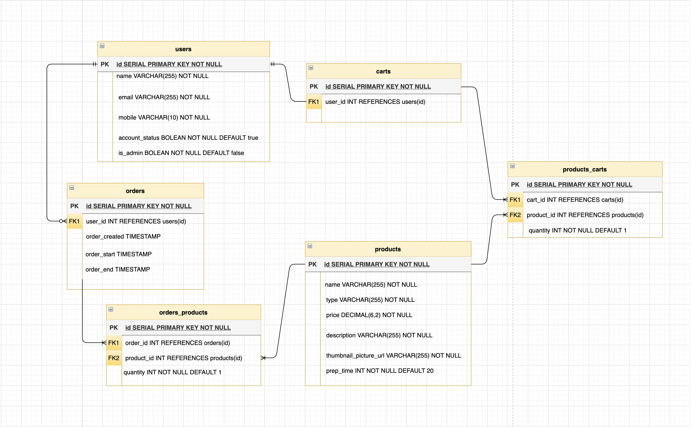

# iHUNGRY - Food Pick-up Ordering App

### Midterm project for [Lighthouse Labs](https://github.com/lighthouse-labs) Immersive Web Development Bootcamp.

A food ordering experience for a single restaurant. Hungry clients of this fictitious restaurant can visit its website, select one or more dishes and place an order for pick-up. They will receive a confirmation message when their order is placed and when it is ready for a pick-up.

The restaurant and client both are both notified since this app serves as an intermediary.
Every time an order is placed the restaurant receives a notification via SMS.

A modern telecomm API service Twilio is used to implement SMS communication from the website to the client and restaurant.

# Final Product

## Client Side Experience
---------------------

## Restaurant Side Experience

## Database Design

## Project Stack

- **Front-End: HTML, SASS, JavaScript, jQuery**
- **Back-End: Nodejs, Express, PSQL**

## Project Features

- Users can see the list of available menu items
- Users can filter menu items by type
- Users can see the details and description of an individual item
- Users can add items to the cart
- Users can see the content of their cart and the order total
- Users can remove an item from the cart
- Users can place their order
- Users receive a personalized SMS confirmation with a time estimate for the order pick-up
- Users can see the status of their order on the app - the countdown timer
- Users can see all their previous orders
- Users receive an SMS when their order is ready
- Restaurant administraitor receives an SMS with the order id and the customer's name when a new order is placed
- Restaurant administraitor sees the list and details of all outstanding orders
- Restaurant administraitor sees a prep time estimate for each order
- Restaurant administraitor can submit the confirmation when the order is done
- Restaurant administraitor can see the list of all past orders from all the customers

## Getting Started

1. Create the `.env`
2. Update the .env file with your correct local information 
  - username: `labber` 
  - password: `labber` 
  - database: `midterm`
3. Install dependencies: `npm i`
4. Fix to binaries for sass: `npm rebuild node-sass`
5. Reset database: `npm run db:reset`
  - Check the db folder to see what gets created and seeded in the SDB
7. Run the server: `npm run local`
  - Note: nodemon is used, so you should not have to restart your server
8. Visit `http://localhost:8080/`
9. Do not edit the `layout.css` file directly, it is auto-generated by `layout.scss`

## Dependencies

- Node 10.x or above
- NPM 5.x or above
- pg
- body-parser
- cookie-parser
- chalk
- dotenv
- ejs
- express
- morgan
- twilio

## Collaboration

- [Ricardo](https://github.com/ricardowgomes)
- [William](https://github.com/williamwyj)
- [Iuliia](https://github.com/juliasut)
